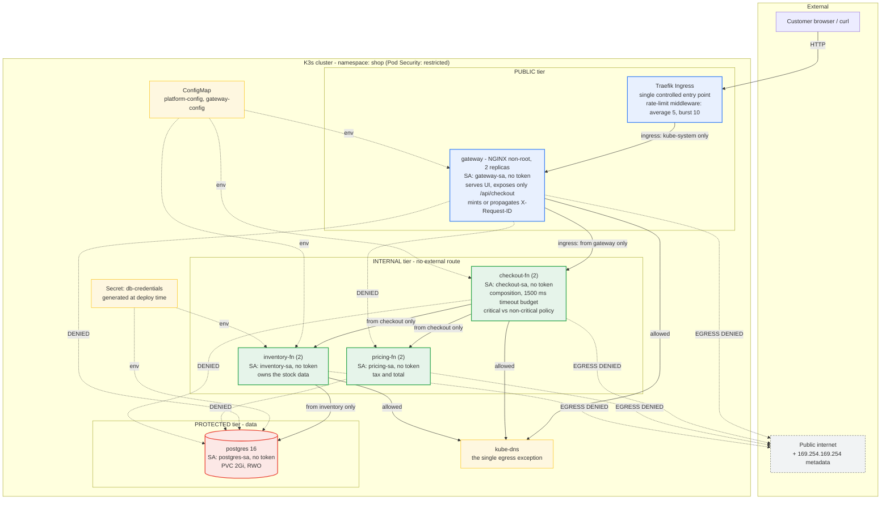

# Diagram 1 — Implemented architecture with trust tiers, identity and policy

This diagram reflects what is deployed, not only what was proposed. Every edge shown as denied is
an actual NetworkPolicy outcome verified by `scripts/60-test-networkpolicy.sh`.

**How to read it.** Solid arrows are the only permitted paths. Dotted `DENIED` edges are routes
that exist on the flat pod network but are refused by policy — the six lateral cases (B1–B6) and
the four attacker-pod cases (C1–C4). Dotted `EGRESS DENIED` edges are the five outbound cases
(D1–D5), including the cloud metadata endpoint reachable from the workload that holds the database
credentials. DNS is the one deliberate egress exception; without it service discovery fails and the
resulting outage looks like an application bug rather than a policy bug.

Each workload carries its own ServiceAccount with no API permissions and token automounting
disabled, so no pod runs as `default` and no pod can present a cluster identity it was not granted.
