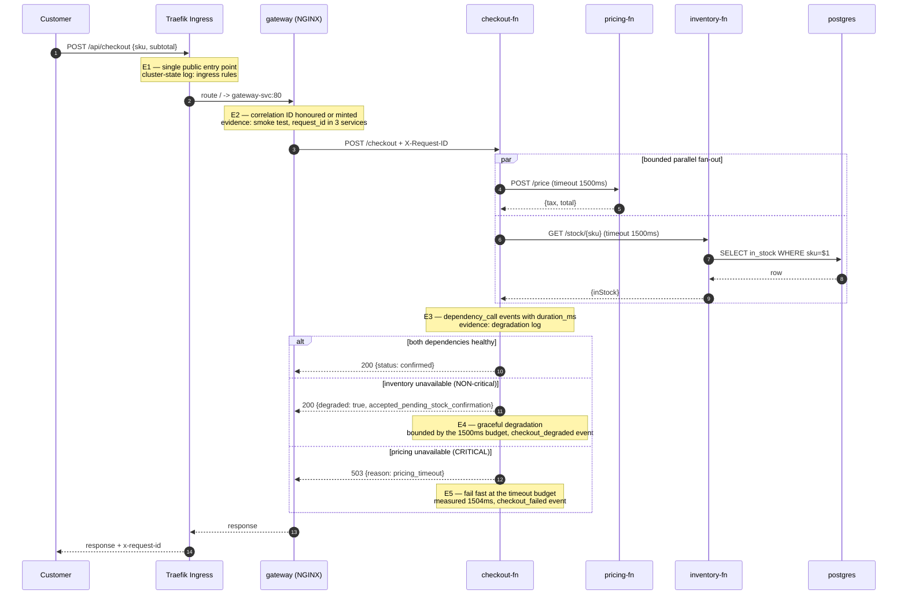

# Diagram 2 — Main request flow and evidence points

## Evidence point index

| ID | Claim under test | Script | Evidence file |
|---|---|---|---|
| E1 | One controlled public entry point; app ports not published | `90-capture-evidence.sh` | `cluster-state-*.log` |
| E2 | Request correlation propagates across every hop | `30-smoke-test.sh` | `smoke-test-*.log` |
| E3 | Per-dependency latency is observable | `50-test-degradation.sh` | `degradation-*.log` |
| E4 | Non-critical dependency loss degrades, not fails | `50-test-degradation.sh` | `degradation-*.log` |
| E5 | Critical dependency loss fails fast within budget | `50-test-degradation.sh` | `degradation-*.log` |
| E6 | Trust tiers are enforced, not just drawn | `60-test-networkpolicy.sh` | `networkpolicy-*.log` |
| E7 | Data survives pod replacement | `70-test-persistence.sh` | `persistence-*.log` |
| E8 | Rollout safety, measured against a control group rather than asserted: 3.4% to 1.4% failures, **not zero** | `45-test-rolling-update-ab.sh` | `rolling-update-ab-*.log` |
| E9 | Config and image security posture, with fixes verified | `80-security-audit.sh`, `81-trivy-v1-vs-v2.sh`, `82-trivy-v1-detail.sh`, `83-kubesec-all-and-metrics.sh` | `security-audit-*.log`, `trivy-v1-vs-v2-*.log`, `trivy-v1-detail-*.log`, `kubesec-all-workloads-*.log` |
| E10 | Excess load is refused at the edge, protecting admitted requests | `55-test-ratelimit.sh` | `ratelimit-*.log` |
| E11 | Readiness is a traffic gate: a not-Ready pod is withheld from the Service | `56-test-readiness-gate.sh` | `readiness-gate-*.log` |
| E12 | A bad image cannot complete a rollout, and rollback restores service | `57-test-rollout-failure-recovery.sh` | `rollout-failure-recovery-*.log` |
| E13 | A configuration error is diagnosed from cluster evidence, then fixed | `58-test-misconfig-diagnosis.sh` | `misconfig-diagnosis-*.log` |
| E14 | Scaling holds availability but is bounded by one node's capacity | `59-test-scaling.sh` | `scaling-*.log` |
| E15 | The platform rebuilds from manifests alone | `95-rebuild-from-scratch.sh` | `rebuild-from-scratch-*.log` |
