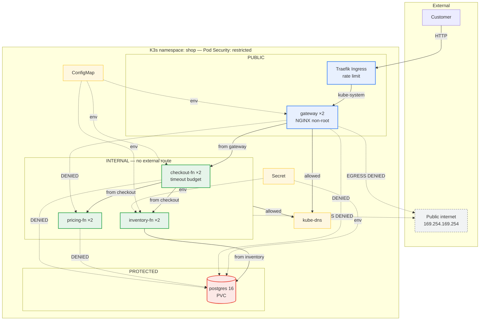
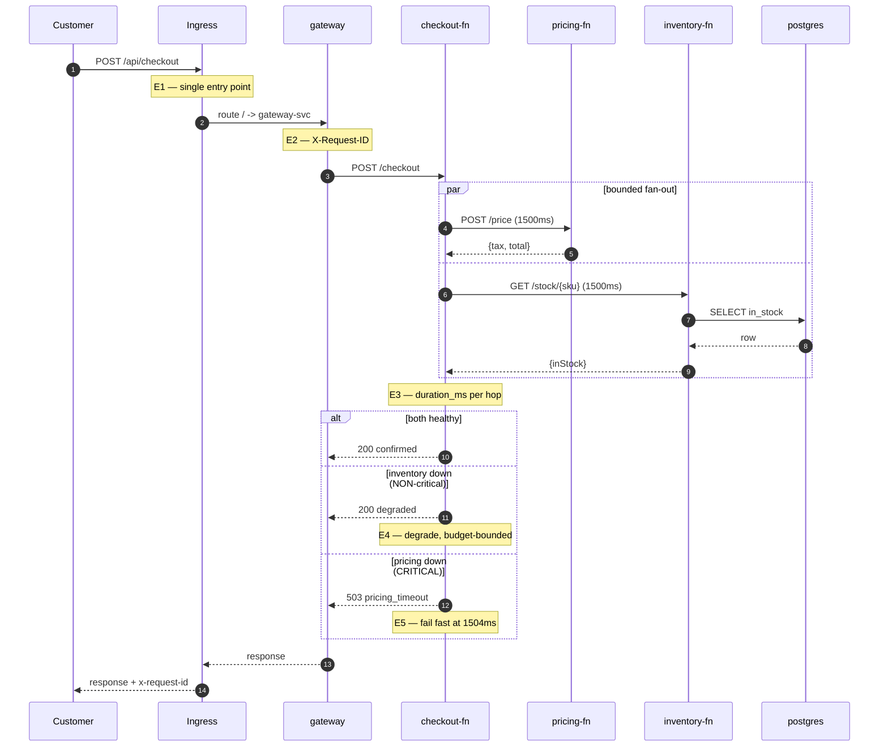

# Enterprise Architecture Design — Supplemental Assignment

**Name:** Xi Yu

**Student ID:** X00231097

**Module:** ENTPH6001 Enterprise Architecture Design

**Submission:** Cloud-native architecture for a small e-commerce checkout platform

**Word count (Sections 1–5, excluding figures, references and appendices):** 1992

**Repository:** https://github.com/TravellerXi/entph6001-checkout-platform

**Screencast:** `screencast.mp4`, submitted alongside this report

---

## 1. Architecture Proposal

The organisation runs its checkout application as a small set of containers, leaving every
dependency implicit: anything can call anything, configuration travels with the image, and one
slow component stalls the customer path. The proposal makes these relationships enforceable.

**Service decomposition.** The system is decomposed along business capability rather than
technical layer, following bounded-context reasoning: `pricing-fn` owns tax and totals,
`inventory-fn` owns stock and the stock datastore, and `checkout-fn` composes them into an order
decision. A separate `gateway` serves the UI and exposes one API route. The split is deliberately
small: at this size the dominant risk is operational overhead, not team scaling, so services were
justified by differing rates of change and failure isolation rather than by count.
`inventory-fn` alone owns its schema, preventing the shared-database coupling that turns a
distributed system into a distributed monolith.

**Request entry.** External traffic enters through one controlled point: a Traefik Ingress routing
to `gateway-svc`. The gateway terminates the public contract, exposes only `/api/checkout`, and
either honours an inbound `X-Request-ID` or mints one. Internal services publish no external route.

**Trust tiers.** Workloads are classified **public** (gateway), **internal** (checkout, pricing,
inventory) and **protected** (PostgreSQL). The classification is not documentation: a deny-by-default
NetworkPolicy covering **both ingress and egress** (Kubernetes, 2026b), plus directed
allow-rules, makes each tier boundary a control the platform enforces. Omitting egress rules is a
serious gap: a compromised workload with unrestricted outbound access can exfiltrate data or reach
a metadata endpoint, the mechanism behind the Capital One breach (Lee, 2026). Here
`pricing-fn` and `postgres` have empty egress, and only `inventory-fn` reaches the database.

**State, configuration and secrets.** Stock data lives in PostgreSQL backed by a
PersistentVolumeClaim. Non-secret configuration (dependency URLs, timeout budget, tax rate,
database host) comes from a ConfigMap; credentials come from a Secret injected as environment
variables. Nothing is baked into an image, and the repository holds only a Secret *template*,
the real value generated at deploy time.

**Workload identity.** Each workload runs under its own ServiceAccount holding no API permissions,
with token automounting disabled. Sharing the namespace `default` account makes API activity
unattributable; separate identities are free and make any future grant precise.

**Migration path.** Because the gateway owns the public contract, routes can move behind it one at
a time — the strangler-fig pattern (Fowler, 2004) — so the existing deployment keeps serving while
capabilities are cut over. That is why the gateway is a distinct workload, not ingress annotations.

**Operational and security boundaries.** Two decisions carry most of the resilience argument.
First, `checkout-fn` applies a 1500 ms timeout budget per dependency, so a slow dependency cannot
hold customer requests open. Second, dependencies are classified: pricing is **critical** (no
total, no order), inventory **non-critical** (the order can be accepted with stock unconfirmed).
Health probes follow the same logic (Kubernetes, 2026a). Liveness is shallow everywhere, because a
liveness probe touching a dependency converts a dependency outage into a restart storm; among
the application services only `inventory-fn`, which owns the datastore, probes it in readiness.
`checkout-fn` readiness excludes its dependencies, since probing them would remove every replica
and turn partial failure into total outage.

**Figure 1 — Implemented architecture with trust tiers, workload identity and enforced policy.** Solid arrows are permitted paths. Dotted `DENIED` and `EGRESS DENIED` edges are refused by NetworkPolicy and are the cases verified in Appendix D; `kube-dns` is the single deliberate egress exception.

## 2. Implementation Summary

The prototype runs on single-node K3s (v1.36.3) on Ubuntu 24.04 (Rancher, 2026), installed with
the module's procedure. Images are built locally and imported into containerd, so no registry is
assumed.

Implemented: four Deployments (gateway ×2, checkout ×2, pricing ×2, inventory ×2) plus PostgreSQL;
five ClusterIP Services; one Ingress carrying an edge rate-limit middleware; two ConfigMaps; one
Secret; one PVC; twelve NetworkPolicies covering both directions; probes, resource limits and
`restricted` Pod Security (Kubernetes, 2026c) on every workload, with non-root execution, dropped
capabilities and no token mounting.
Four choices map design intent onto configuration. Two replicas everywhere make the readiness gate
meaningful: a bad replica can be withheld while another serves. `TIMEOUT_MS=1500` bounds a slow
dependency. PostgreSQL uses `Recreate` because one RWO volume cannot be shared by two pods
mid-rollout. The gateway runs `nginx-unprivileged` because stock NGINX cannot satisfy the
`restricted` standard.

Structured JSON logging with request-ID propagation was added to the three application services.
The platform deploys with one command and was verified by deleting the namespace and rebuilding:
teardown 61 seconds, rebuild to a working checkout **30 seconds** (Appendix E).

**Gaps against the proposal.** Three things are designed but not implemented, for scope not
oversight: the Ingress serves HTTP (no certificate authority in scope), the database is a single
replica with no backup or failover, and the checkout API has no authentication. Each returns in
Section 5.

**Figure 2 — Main request flow, with the evidence point behind each claim.** Appendix B holds the measurements for E3–E5; `docs/diagram-2-request-flow.md` carries the full evidence index.

## 3. Operational Behaviour

The behaviour selected is **partial failure: graceful degradation versus fail fast**, because it
tests the dependency classification directly. Healthy, a checkout returns `200 confirmed` in 11 ms.
With `inventory-fn` scaled to zero it returns 200, marked degraded, in 1502 ms. With `pricing-fn`
delayed 3000 ms it returns `503 pricing_timeout` in 1504 ms (Appendix B). A repeat run degraded in
8.5 ms, because a Service with no endpoints refused the connection rather than hanging: the budget
bounds the cost of degradation without describing it.

Both claims hold: the non-critical dependency degrades rather than rejecting the customer, and the
critical one fails fast at the configured budget. The measured
1502/1504 ms confirms that when a dependency hangs, the 1500 ms timeout binds rather than network
timing. The cost is visible too: when the budget binds, degradation turns an 11 ms response into
a 1502 ms one. Under sustained failure that consumes connection capacity (Google,
2016); a circuit breaker is the correct next step (Fowler, 2014).

A second experiment came from a real defect: an intermittent 502 during a rollout, reproduced by
the control group. A `preStop` delay plus a 30-second grace period lets the endpoints controller
remove the pod first (Kubernetes, 2026e). Run as a controlled A/B rather than a single run, the
control failed 6 of 179 requests (3.4%) and the fixed group 3 of 208 (1.4%). At these sample sizes
that difference is not statistically significant, and the control also ran a 1-second grace period
against the 30-second default, so two variables moved together. What it establishes is that
failures were **not eliminated**, and that an earlier run returning 204/204 was unrepresentative
(Appendix C2).
A third experiment tests admission control, which is load shedding at the edge. A 30-request burst
without the rate-limit middleware (Traefik Labs, 2026) admitted all 30 at a p95 of 0.168 s; with
it, 11 were admitted and 19 refused with HTTP 429, and the admitted requests completed at a p95 of
0.075 s. The two samples differ in size and selection, so this shows the direction of the effect
rather than its magnitude (Appendix C1): admitting everything spreads the delay across all
callers; rejection concentrates it on some.

A fourth set asked what happens when a *change* is wrong rather than a dependency slow. A broken
readiness path, a broken image tag, and the gateway upstream reverted to its Compose name were
injected separately (Appendix C3–C5). All three were contained by the readiness gate a replica
must pass before receiving traffic, and user-visible impact was unobserved: 10/10,
15/15 and 5/5 checkouts returned 200. Operators saw the failure; users did not, so a broken release
can sit unnoticed unless rollout state is alerted on.

## 4. Observability and Security Validation

**Observability.** The three application services emit structured JSON with a shared `request_id`,
and `checkout-fn` adds per-dependency `duration_ms`. One request is traceable across all three, and
the per-hop timings identified the timeout as the cause in Section 3. This is
deliberately log-based rather than a full tracing stack: on one node, correlation IDs deliver
most of the diagnostic value far more cheaply (Appendix A). The limitation is real: no sampling,
retention, aggregation or dashboard.

**Security validation 1 — are the trust boundaries real?** The tiers were tested, not asserted:
four documented paths must work, six lateral and five outbound paths must fail, and an
unlabelled pod simulating a compromised workload must reach nothing. **All
19 cases passed** (Appendix D). The egress cases matter most: no application workload reaches the
public internet, and the metadata endpoint at 169.254.169.254 is unreachable from the service
holding database credentials. NetworkPolicy objects are silently inert without a policy-capable
CNI, so the negative controls prove enforcement rather than intent. DNS is the one exception;
without it service discovery fails and the outage looks like an application bug.

The limits matter as much as the result. No probe starts from Postgres, so its egress policy is
untested; node traffic is permitted regardless of policy; and NetworkPolicy records nothing about
what it allowed or blocked, so this control has no audit trail. It isolates reachability only.

**Security validation 2 — configuration and image posture.** `kubesec` (Controlplane, 2026) scores
all five Deployments, read from the live cluster so the score describes what actually runs. The
four application workloads score **12** (a raw score, not a ratio) — non-root, dropped
capabilities, read-only root filesystem, resource limits, dedicated identities, no token
automounting. Postgres scores **11**, missing only `ReadOnlyRootFilesystem`. Trivy (Aqua Security,
2026) reported 1 CRITICAL and 6
HIGH per service image, including CVE-2026-59873 in `node-tar`. Interpretation mattered more than
the count: every finding came from the npm CLI in the base image, not application dependencies;
runtime reachability was untested. Rather than suppress them, the images were rebuilt multi-stage without
the package manager; the same scan returns **0 CRITICAL and 0 HIGH** (Appendix F).

**Prioritised issues**, ordered by how easily each is exploited without credentials. (1) Secrets
are base64 only and K3s disables encryption at rest (Kubernetes, 2026d): any principal with
`get secret` reads the database password. (2) No authentication on the checkout API. (3) No TLS.
(4) Lower priority: no AppArmor profile and UIDs below 10000. One flag is a false negative: kubesec
reports missing seccomp, but its selector reads the deprecated annotation, while
every workload sets `seccompProfile: RuntimeDefault` (Appendix F): taking the scanner literally
would have meant fixing a control already in place.

## 5. Critical Evaluation

The strongest aspect is that the architecture's claims are testable and were tested: tier
separation, degradation, timeout budget, persistence and rollout safety each have a script
producing evidence. One script found a real defect; the control group measuring the fix showed it
is partial.
The weaknesses are equally clear. **Single points of failure**: one node, one database replica, so
node loss is total outage; RPO and RTO are undefined and backups do not exist. **Identity is
missing**: NetworkPolicy enforces reachability, not identity, so the trust model is entirely
network-based, contradicting the Zero Trust principle that network location must not imply trust
(NIST, 2020); a compromised `checkout-fn` is indistinguishable from a legitimate one to
`inventory-fn`. mTLS with workload identity is the most valuable next increment. **Degradation is
timeout-bound, not circuit-broken**. **The PVC gives restart survival, not recoverability**: it
outlived pod replacement but died with the namespace during the rebuild (Appendix G).

Two trade-offs were accepted deliberately. A service mesh would supply mTLS, retries and telemetry
uniformly, but for four services it adds a control plane and sidecar overhead this organisation
cannot operate; NetworkPolicy plus application timeouts covers most of the benefit far more
cheaply. Scale-to-zero was rejected because cold starts would add latency to the checkout path and
idle cost is not the constraint at this size. A third alternative, asynchronous messaging, is not
settled. The two dependencies are called in parallel, so tail latency is bounded by the slower, not
their sum; what is still coupled is availability. The degraded response returned when
inventory is unavailable is a promise to confirm stock later, and nothing records or honours it. A
durable queue with idempotent consumers and a dead-letter path is the standard remedy, rejected
because a stateful broker would add a second single point of failure on one node. The promise
remains outstanding: an acknowledged gap, not a resolved trade-off.

If continued: encryption at rest and a secrets manager; TLS and authentication
at the edge; workload identity for east–west calls; a circuit breaker on inventory; then backup and
restore rehearsal, because untested recovery is an assumption, not a control.

## 6. References

Aqua Security (2026) *Trivy documentation*. Available at: https://trivy.dev/ (Accessed: 14 August 2026).

Controlplane (2026) *kubesec — security risk analysis for Kubernetes resources*. Available at: https://kubesec.io/ (Accessed: 14 August 2026).

Fowler, M. (2004) *StranglerFigApplication*. Available at: https://martinfowler.com/bliki/StranglerFigApplication.html (Accessed: 14 August 2026).

Fowler, M. (2014) *CircuitBreaker*. Available at: https://martinfowler.com/bliki/CircuitBreaker.html (Accessed: 14 August 2026).

Google (2016) *Site Reliability Engineering: Addressing Cascading Failures*. Available at: https://sre.google/sre-book/addressing-cascading-failures/ (Accessed: 14 August 2026).

Kubernetes (2026a) *Configure Liveness, Readiness and Startup Probes*. Available at: https://kubernetes.io/docs/tasks/configure-pod-container/configure-liveness-readiness-startup-probes/ (Accessed: 14 August 2026).

Kubernetes (2026b) *Network Policies*. Available at: https://kubernetes.io/docs/concepts/services-networking/network-policies/ (Accessed: 14 August 2026).

Kubernetes (2026c) *Pod Security Standards*. Available at: https://kubernetes.io/docs/concepts/security/pod-security-standards/ (Accessed: 14 August 2026).

Kubernetes (2026d) *Encrypting Confidential Data at Rest*. Available at: https://kubernetes.io/docs/tasks/administer-cluster/encrypt-data/ (Accessed: 14 August 2026).

Kubernetes (2026e) *Pod Lifecycle: termination of Pods*. Available at: https://kubernetes.io/docs/concepts/workloads/pods/pod-lifecycle/ (Accessed: 14 August 2026).

Lee, E. (2026) *Enterprise Architecture Design: Lectures 1–12 and Laboratory Materials*. ENTPH6001, TU Dublin.

NIST (2020) *SP 800-207: Zero Trust Architecture*. doi: 10.6028/NIST.SP.800-207.

Rancher (2026) *K3s documentation: Networking and Traefik Ingress*. Available at: https://docs.k3s.io/networking (Accessed: 14 August 2026).

Traefik Labs (2026) *Traefik Kubernetes Ingress documentation*. Available at: https://doc.traefik.io/traefik/providers/kubernetes-ingress/ (Accessed: 14 August 2026).

### AI tools declaration

GitHub Copilot (Claude Opus 5) was used to assist with drafting manifests, service code, test
scripts and report structure. All deployments, experiments and measurements reported here were
executed by the author on the cluster described, and every figure quoted is taken from the captured
evidence logs in the appendices. No result in this report is estimated or reproduced from memory.
